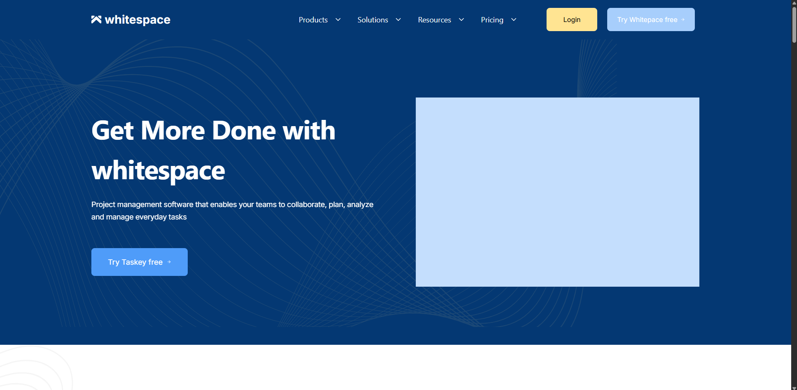
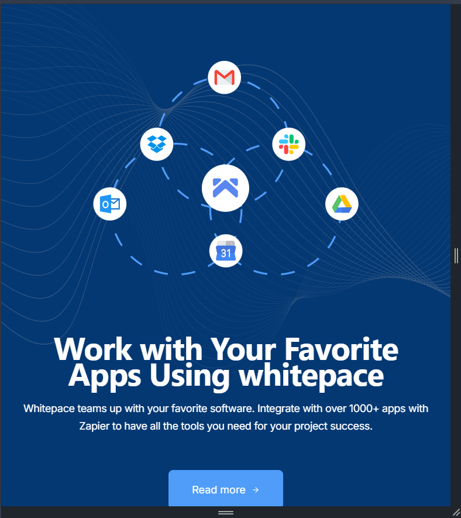

# Whitepace Landing Page

Адаптивный SaaS-лендинг, разработанный по макету из Figma.

## Ссылки

🌐 [Live Demo](https://landing-page-1-one-liart.vercel.app)

🎨 [Figma Design](https://www.figma.com/design/HgK7gopD5RypgR2TU04gjR/Whitepace---SaaS-Landing-Page--Community-?node-id=9-101&t=gunY2UdAG3zAWGxf-1)

## Скриншоты





## О проекте

Данный проект представляет собой pixel-perfect реализацию SaaS-лендинга Whitepace по готовому макету из Figma. Проект разработан с использованием React, JavaScript и Tailwind CSS. Основной целью было максимально точно воспроизвести оригинальный дизайн и реализовать адаптивный пользовательский интерфейс для различных устройств.

## Локальный запуск

```bash
git clone https://github.com/sky1452/landing-page-1.git

cd landing-page-1

npm install

npm run dev
```